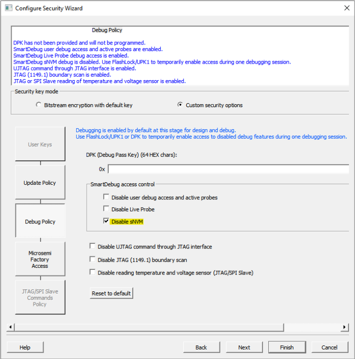

# Disabling SmartDebug Access to sNVM in Libero SoC Debug Policy Settings

With Libero SoC v2021.1, the user setting to disable SmartDebug access to sNVM is now enforced in user/debug pass key protected devices.

Prior to Libero SoC v2021.1, disabling SmartDebug access to read the sNVM in Libero SoC's device Debug Policy settings did not affect the generated programming bitstream and, as a result, did not prevent SmartDebug access to the sNVM in user/debug pass key protected devices. This issue existed for PolarFire FPGAs starting with Libero SoC v12.0 and for PolarFire SoC FPGAs starting with Libero SoC v12.5. The issue occurs if **Disable sNVM** is checked in the Libero SoC Debug Policy settings dialog box during the Configure Security design flow step, or if the equivalent Tcl command is executed.

## Example TCL Command {#SECTION_HTX_MWQ_N4B .section}

`configure_tool -name {SPM} -params {disable_smartdebug_snvm:true}`

## Application Impact {#SECTION_VZR_CWQ_N4B .section}

After opening the Libero SoC project matching the one programmed into the device, running SmartDebug Design from the Libero SoC design flow pane allows SmartDebug to read the sNVM content without requiring the user/debug pass key.

Similarly, when launching SmartDebug in stand-alone mode, and loading the debug database file \(.DDC\) matching the design programmed into the device, SmartDebug can read the sNVM content without requiring the user/debug pass key.

## Required Action {#SECTION_WZR_CWQ_N4B .section}

To disable SmartDebug access to the sNVM without the user/debug pass key, re-run the Configure Security design flow step using Libero SoC v2021.1 with the desired user/debug pass key and with **Disable sNVM** checked, and then regenerate the programming bitstream and reprogram the device with the updated security settings.

Pre-existing designs opened in v2021.1 that already have **Disable sNVM** SmartDebug access policy configured will receive a message in the Libero SoC log window that the Programming File Generation design flow steps have been invalidated. The user must then re-confirm the settings in the Configure Security Wizard and regenerate the bitstream before reprogramming the device security settings.

## Part Numbers Affected {#SECTION_RHG_XWQ_N4B .section}

For list of affected part numbers, see Appendix A and Appendix B.??

**Parent topic:**[Customer Notification \(CN\) Support](GUID-9BA95D0E-AC37-44BA-AF00-0731123E00A8.md)

