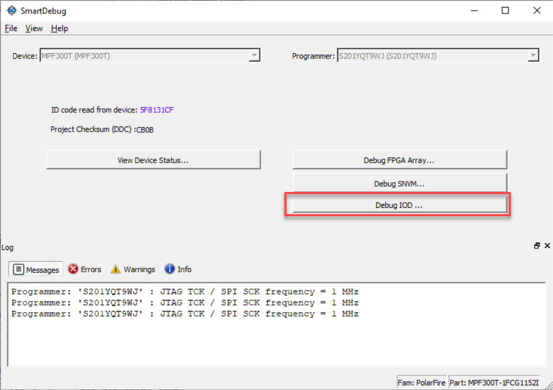

# SmartDebug I/O Tap Delays

Libero SoC v2021.1 permits debugging of source synchronous timing margins for dynamically tuned PF\_IOD\_GENERIC\_RX IP interfaces.

To account for this new feature, the SmartDebug main page for PolarFire designed shows a **Debug IOD** button when there is a PF\_IOD\_GENERIC\_RX IP instance configured as Dynamic or Fractional Dynamic mode in the design. The button is not shown for designs where the IP in the modes mentioned is not used.

For more details, see the *SmartDebug User Guide*.

**Parent topic:**[PolarFire, RT PolarFire, and PolarFire SoC](GUID-0DF426A6-97DD-4626-83B9-A155BAC489D8.md)

