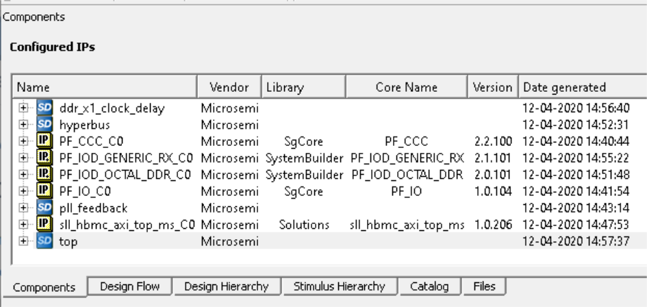

# New Components View

Libero SoC v2021.1.introduces a new Components view that lists all configured components and SmartDesign modules in a project.

The view appears as a tab in the left area of Libero and lists all configured components and SmartDesigns in the project when a project is open \(see the following figure\). The same view is used in the stand-alone CoresViewApplication.

**Parent topic:**[Software Features and Enhancements](GUID-F7331C45-88A6-4620-982C-03B62E275FB2.md)

